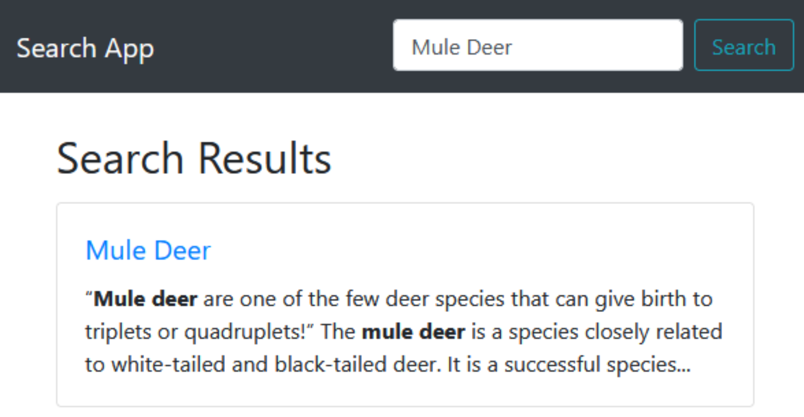
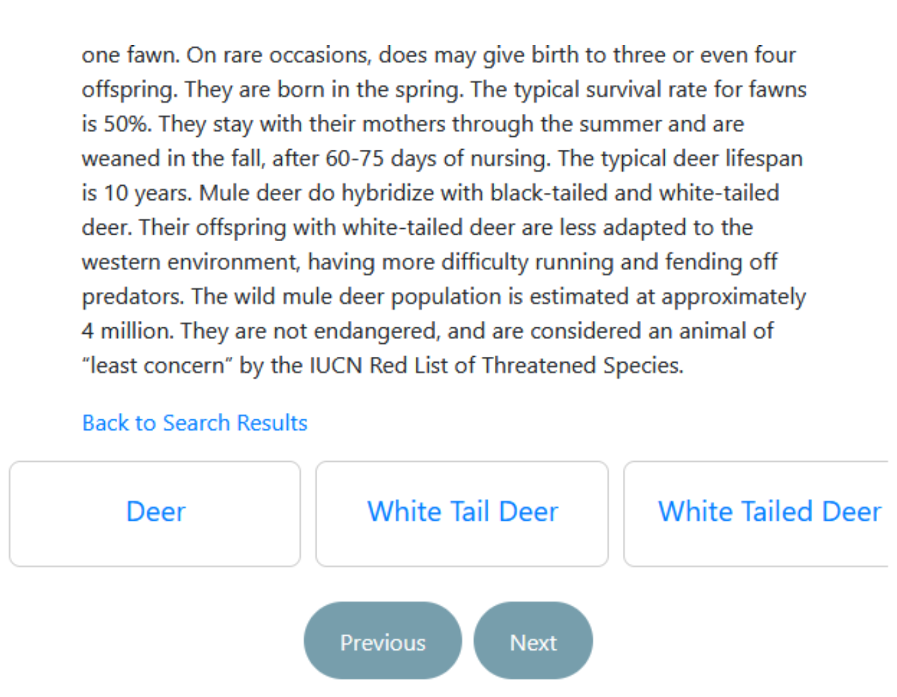

# PRI Project - Animal Information Retrieval System

This repository contains the code and documentation for developing an information retrieval system focused on animal data using **Apache Solr**.

See the final [Project Report](docs/report-43.pdf) or the presentation [Slides](docs/demo-43.pdf) for a comprehensive overview of the project.

Alternatively, you can see the project video for a visual demonstration of the system in action and a summary of our performed work:

## Project Overview

- **Objective:** To create an effective information retrieval system for animal data by leveraging Apache Solr.
- **Data Acquisition:** Obtained a substantial dataset from [A-Z-Animals.com](https://A-Z-Animals.com), ensuring coherence and completeness.
- **Exploratory Data Analysis:** Conducted analysis to evaluate dataset quality, identify fields, and understand information requirements.
- **Information Retrieval Phase:** Utilized Apache Solr to design and execute five search scenarios, collecting relevant metrics for comparison.
- **Search System Improvement:** Explored various strategies to enhance the search system's performance, with mixed success but evident improvement.

## Key Components

- **Dataset Analysis:** Detailed examination of the acquired animal dataset to ensure suitability for the information retrieval system.
- **Schema Design:** Creation of two schemas tailored for optimizing information retrieval within Apache Solr.
- **Search Scenarios:** Execution of five distinct search scenarios to evaluate system effectiveness and efficiency.
- **Metric Analysis:** Collection and analysis of metrics including precision, recall, F-Measure, and Mean Average Precision (MAP) to assess system performance.
- **System Enhancement:** Exploration of different approaches to improve search system results based on metric feedback.

## Usage

- **Data Processing:** Use provided scripts to preprocess and transform the animal dataset for optimal indexing.
- **Schema Configuration:** Adjust schema design based on specific project requirements and evaluation outcomes.
- **Query Execution:** Execute predefined search scenarios and collect relevant metrics for evaluation.
- **System Enhancement:** Experiment with different strategies to improve search system performance based on metric feedback.

## Results

- **Initial Metrics:** MAP of 49% indicated room for improvement, particularly in certain query scenarios.
- **Enhancement Efforts:** Despite mixed success, significant improvement observed in system performance.
- **Future Directions:** Opportunities for further refinement and enhancement to deliver valuable insights into animal information.

## Conclusion

The project successfully established a high-quality information retrieval system for animal data, leveraging Apache Solr. By combining a well-curated dataset with optimized search system configurations, the system demonstrates effectiveness in delivering relevant and valuable insights into the natural world.

More details can be found in each delivery zip file present in the repository.
